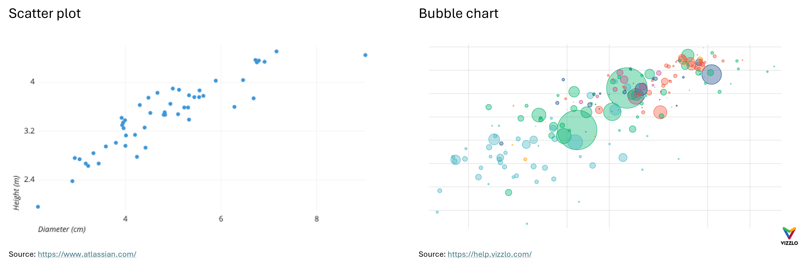
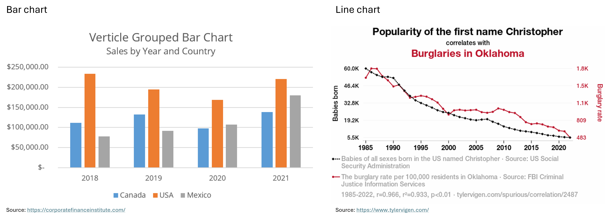

:::::::::::::::::::::::::::::::::::::: questions 

- Why is data visualization important in humanities research?
- What are some effective graph types for use in humanities research?

::::::::::::::::::::::::::::::::::::::::::::::::

::::::::::::::::::::::::::::::::::::: objectives

- Discuss the benefits of data visualization in humanities research.
- Explore the most effective graph types for data visualization in the humanities.

::::::::::::::::::::::::::::::::::::::::::::::::

::::::::::::::::::::::::::::::::::::: challenge 

## Question

Why is it helpful to visualize data in humanities research?

:::::::::::::::::::::::: solution 

## Answer
 
Data visualization has multiple purposes. It can help you understand trends and correlations in a dataset. 
It can also help you introduce a dataset to others in scientific texts or in data storytelling.

:::::::::::::::::::::::::::::::::
::::::::::::::::::::::::::::::::::::::::::::::::

Most graphs used for data visualization fall into one of the following four general categories, based on their function. 
In this lesson, we won’t cover how to create all of these graphs in Python, but will focus on a few that are 
useful for statistical inference and data storytelling with our specific dataset. However, 
it's helpful to know the names of these graphs and understand the contexts in which they can be applied.

:::::::::::::::::::::::::::::::::::::::::::::::::::::::::::::::::::: instructor

This episode is more meant for self study. You don't need to go into extensive detail about the content of this episode. Instead, focus on reviewing the graphs 
with the learners and ask if they are already familiar with them and their use cases. The most important graphs to 
highlight—those that will also be featured in the visualization section of this lesson—are scatter plots, 
bubble charts, and correlograms. Place greater emphasis on these and prepare the learners to create them in the 
visualization section. 

::::::::::::::::::::::::::::::::::::::::::::::::::::::::::::::::::::::::::::::::

## 1. Explore Relationships between two or more Features

**Scatter Plot:** "A scatter plot (aka scatter chart, scatter graph) uses dots to represent values for two different 
numeric variables. The position of each dot on the horizontal and vertical axis indicates values for an individual 
data point. Scatter plots are used to observe relationships between variables." 
([Atlassian](https://www.atlassian.com/data/charts/what-is-a-scatter-plot)) For example, the X-axis can represent 
the age of the employees at a company, where the Y-axis represents their income.

**Bubble Chart:** "A bubble chart (aka bubble plot) is an extension of the scatter plot used to look at 
relationships between three numeric variables. Each dot in a bubble chart corresponds with a single data point, 
and the variables’ values for each point are indicated by horizontal position, vertical position, and dot size." 
([Atlassian](https://www.atlassian.com/data/charts/bubble-chart-complete-guide)) In addition to representing 
three *numerical* features with their X and Y values and bubble size, a bubble chart can also represent a 
*categorical* feature through color. For example, if the X-axis represents the age of employees at a company, 
the Y-axis represents their income, and the size of the bubbles represents their years of work experience, 
the color of the bubbles can indicate their gender.

**Heatmap:** "A heatmap (aka heat map) depicts values for a main variable of interest across two axis variables 
as a grid of colored squares. The axis variables are divided into ranges like a bar chart or histogram, 
and each cell’s color indicates the value of the main variable in the corresponding cell range." 
([Atlassian](https://www.atlassian.com/data/charts/heatmap-complete-guide))

**Correlogram:** "A correlogram is a variant of the heatmap that replaces each of the variables on the two axes 
with a list of numeric variables in the dataset. Each cell depicts the relationship between the intersecting 
variables, such as a linear correlation. Sometimes, these simple correlations are replaced with more complex 
representations of relationship, like scatter plots. Correlograms are often seen in an exploratory role, 
helping analysts understand relationships between variables in service of building descriptive or predictive 
statistical models." ([Atlassian](https://www.atlassian.com/data/charts/heatmap-complete-guide)) 
For example, a correlogram can reveal the correlations between features such as the sepal width, petal length, 
and petal width of an iris, showing how closely these attributes are related to each other.

Below you can see examples of a scatter plot, a bubble chart, a heatmap and a correlogram:

## 2. Compare Different Measures or Trends

**Bar Chart:** "A bar chart (aka bar graph, column chart) plots numeric values for levels of a categorical feature 
as bars. Levels are plotted on one chart axis, and values are plotted on the other axis. Each categorical value 
claims one bar, and the length of each bar corresponds to the bar’s value. Bars are plotted on a common baseline 
to allow for easy comparison of values." ([Atlassian](https://www.atlassian.com/data/charts/bar-chart-complete-guide)) 
For example, the X-axis could represent the skill levels of employees at a company 
(entry-level, mid-level, and advanced), while the Y-axis shows the average annual salary for each group.

**Line Chart:** "A line chart (aka line plot, line graph) uses points connected by line segments from left to right 
to demonstrate changes in value. The horizontal axis depicts a continuous progression, often that of time, while 
the vertical axis reports values for a metric of interest across that progression." 
([Atlassian](https://www.atlassian.com/data/charts/line-chart-complete-guide)) 
For example, the X-axis could represent the years from 2000 to 2024, while the Y-axis shows the average salary of 
advanced employees at two different companies over this time period.

Below you can see examples of a bar chart and a line chart. 

## 3. Explore Distributions

**Histogram:** "A histogram is a chart that plots the distribution of a numeric variable’s values as a series 
of bars. Each bar typically covers a range of numeric values called a bin or class; a bar’s height indicates 
the frequency of data points with a value within the corresponding bin." 
([Atlassian](https://www.atlassian.com/data/charts/histogram-complete-guide)) For example, the bins on the 
X-axis could represent salary ranges such as ¥30,000 - ¥39,999, ¥40,000 - ¥49,999, and ¥50,000 - ¥59,999, 
with the Y-axis showing the number of Japanese employees in each salary range.

**Box Plot:** "Box plots are used to show distributions of numeric data values, especially when you want to 
compare them between multiple groups. They are built to provide high-level information at a glance, offering 
general information about a group of data’s symmetry, skew, variance, and outliers. It is easy to see where 
the main bulk of the data is, and make that comparison between different groups." 
([Atlassian](https://www.atlassian.com/data/charts/box-plot-complete-guide))

"The box itself indicates the range in which the middle 50% of all values lie. Thus, the lower end of the 
box is the 1st quartile and the upper end is the 3rd quartile. Therefore below Q1 lie 25% of the data and above 
Q3 lie 25% of the data, in the box itself lie 50% of your data. Let's say we look at the age of individuals in a 
boxplot, and Q1 is 31 years, then it means that 25% of the participants are younger than 31 years. If Q3 is 63 
years, then it means that 25% of the participants are older than 63 years, 50% of the participants are therefore 
between 31 and 63 years old. Thus, between Q1 and Q3 is the interquartile range.

In the boxplot, the solid line indicates the median and the dashed line indicates the mean. For example, if 
the median is 42, this means that half of the participants are younger than 42 and the other half are older than 
42. The median thus divides the individuals into two equal groups.

The T-shaped whiskers go to the last point, which is still within 1.5 times the interquartile range. 
The T-shaped whisker is either the maximum value of your data but at most 1.5 times the interquartile range. 
Any observations that are more than 1.5 interquartile range (IQR) below Q1 or more than 1.5 IQR above Q3 are 
considered outliers. If there are no outliers, the whisker is the maximum value." 
([DATAtab](https://datatab.net/tutorial/box-plot))

## 4. Draw Comparisons

**Pie Chart:** "A pie chart shows how a total amount is divided between levels of a categorical variable as a 
circle divided into radial slices. Each categorical value corresponds with a single slice of the circle, and the 
size of each slice (both in area and arc length) indicates what proportion of the whole each category level takes." 
([Atlassian](https://www.atlassian.com/data/charts/pie-chart-complete-guide)) For example, a pie chart could 
show the percentage of a company's budget allocated to different task areas.

**Stacked Bar Chart:** "A stacked bar chart is a type of bar chart that portrays the compositions and comparisons 
of several variables through time. Stacked charts usually represent a series of bars or columns stacked on top of 
one another. They are widely used to effectively portray comparisons of total values across several categories." 
([Jaspersoft](https://www.jaspersoft.com/articles/what-is-a-stacked-chart)) For example, the X-axis of a stacked 
bar chart could represent bins, each covering a 5-year interval, while the Y-axis shows the number of employees at 
a company in each interval. Each bar can be divided into groups based on experience level, with different colors 
representing each group.

There are many other types of graphs beyond the ones introduced here, such as area charts, tree maps, funnel charts, 
violin plots, and more. To explore these charts and graphs further, visit the websites 
[Atlassian](https://www.atlassian.com/data/charts/essential-chart-types-for-data-visualization) or 
[Storytelling with Data](https://www.storytellingwithdata.com/chart-guide).

In the next section, we'll take a closer look at the correlographic heatmap, the scatter plot, and the bubble chart. 
We'll learn how to create them in Python and explore how they can contribute to statistical inference and data 
storytelling. To start, let's first introduce the concept of statistical inference.

::::::::::::::::::::::::::::::::::::: keypoints 

- Scatter plots, bubble charts, heatmaps and correlograms for exploring relationships between two or more features
- Bar charts and line charts for comparing different measures or trends
- Histograms and box plots for exploring distributions
- Pie charts and stacked bar charts for drawing comparisons

::::::::::::::::::::::::::::::::::::::::::::::::

